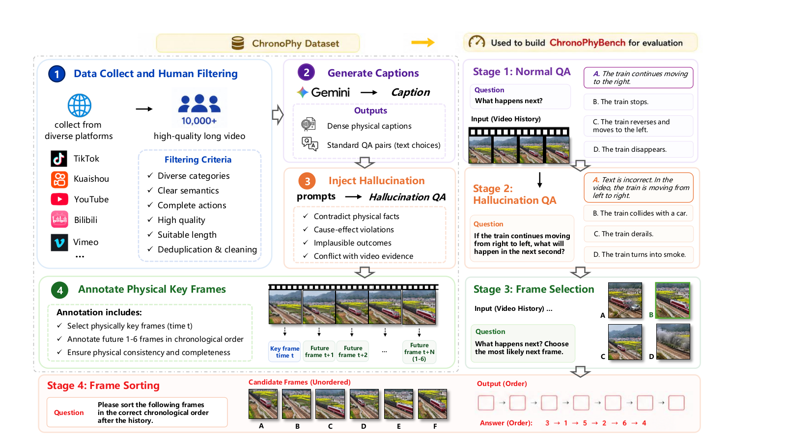

<!-- <p align="center">
    <h1>🔬 PhysVideo-Bench</h1>
    <h3>A Comprehensive Benchmark for Evaluating Physical Reasoning in Video-based Large Language Models</h3>
</p>

<h5 align="center"> -->
<p align="center">
  
</p>
<h2 align="center"> <a href="https://arxiv.org/abs/2606.07962">ChronoPhyBench: Do MLLMs Truly Understand the World or Merely Exploit Language Priors?</a></h2>
<h5 align="center"> If you like our project, please give us a star ⭐ on GitHub for latest update.  </h2>

 
<h5 align="center">

<!-- [](./LICENSE)
[](https://github.com/your-org/PhysVideo-Bench/issues)
[](https://github.com/your-org/PhysVideo-Bench/issues?q=is%3Aissue+is%3Aclosed) -->
[](https://huggingface.co/datasets/Kohsin/ChronoPhyBench)
[](https://arxiv.org/abs/2606.07962)
[](https://github.com/PKU-YuanGroup/ChronoPhyBench/blob/main/LICENSE) 

</h5>

---

* **We identify and systematically expose the prevalence of shortcut learning and modality bias in MLLMs, demonstrating how textual priors induce hallucinations of physical reasoning capabilities.**
* **We introduce ChronoPhyBench, a unified benchmark that employs next-state prediction and chronological sorting to explicitly evaluate cross-modal synthesis and to penalize reliance on a single modality.**
* **We release ChronoPhy, a large-scale dataset of over 10,000 annotated videos, providing the community with a rigorous framework for stress-testing multimodal robustness and advancing the development of Physical AI toward genuine Artificial General Intelligence.**


---

## 📰 News

**[2026.05]** ChronoPhyBench is now open-sourced! The evaluation code is still being organized and will be released soon.

---

## 🎯 Benchmark Overview

ChronoPhyBench evaluates whether Video-LLMs can **understand and reason about physical processes** depicted in real-world video clips. Unlike general video QA benchmarks, our tasks target the models' grasp of **physical laws** — gravity, collision, conservation, friction, deformation — and their ability to reason about **causal chains** in dynamic scenes.

### Task Types

| Task | Description | Output | Metric |
|------|-------------|--------|--------|
| **Multiple-Choice QA** | Watch a video and select the correct text option to answer a physics question, which includes both normal QA and hallucination-based QA. | Single letter  | Accuracy |
| **Temporal Frame Selecting** | Given a historical video, the model is required to select the only next frame that conforms to physical laws from multiple semantically similar but physically incorrect frames. | Single letter | Accuracy |
| **Temporal Frame Sorting** | The model is given an initial video background and a set of randomly shuffled future state images, and is required to rearrange them in the correct temporal and physical order of evolution. | Digit sequence (e.g., `3124`) | Exact Match |

---

## 🔧 Installation

### 1. Clone the repository
```bash
git clone https://github.com/PKU-YuanGroup/ChronoPhyBench.git
cd ChronoPhyBench
```

### 2. Install dependencies
```bash
pip install -r requirements.txt
```


### 3. Data Preparation

The video data can easily be downloaded from [Huggingface](https://huggingface.co/datasets/Kohsin/ChronoPhyBench) 

---

## 🏗️ Usage

### Single-GPU (image-based options)
```bash
python evaluate.py \
  --model_name "your-model-name" \
  --api_key "your-api-key" \
  --json_path "your-json-folder" \
  --video_dir "your-video-folder" \
  --output_dir "your-results-folder"
  --image_root "your-image-folder" \
```

### Multi-GPU distributed (torchrun)
```bash
CUDA_VISIBLE_DEVICES=0,1,2,3 torchrun --nproc_per_node=4 evaluate.py \
  --model_name "your-model-name" \
  --api_key "your-api-key" \
  --json_path "your-json-folder" \
  --video_dir "your-video-folder" \
  --output_dir "your-results-folder"
  --image_root "your-image-folder" \
```


### Key Arguments

| Argument | Description | Default |
|----------|-------------|---------|
| `--model_name` | Model name or local path (auto-detects model type) | Required |
| `--api_key` | API key ("none" for local models) | Required |
| `--json_path` | JSON dataset file or directory | Required |
| `--video_dir` | Root directory of video files | Required |
| `--output_dir` | Result output directory | `./results` |
| `--image_root` | Root of image-based answer options (prediction tasks) | `None` |
| `--reinfer` | Enable N/A retry mode (`true`/`false`) | `false` |

---


## 📝 License

PhysVideo-Bench is released under Apache License Version 2.0.

## 🤝 Citation

```bibtex
@article{zhu2026chronophybench,
  title={ChronoPhyBench: Do MLLMs Truly Understand the World or Merely Exploit Language Priors?},
  author={Zhu, Bin and Jia, Yanhao and Zhao, Kexin and Wang, Jie and Ning, Munan and Li, Hao and Niu, Yuwei and Sun, Tanqing and Yan, Huangchong and Pan, Mingjun and others},
  journal={arXiv preprint arXiv:2606.07962},
  year={2026}
}
}
```
